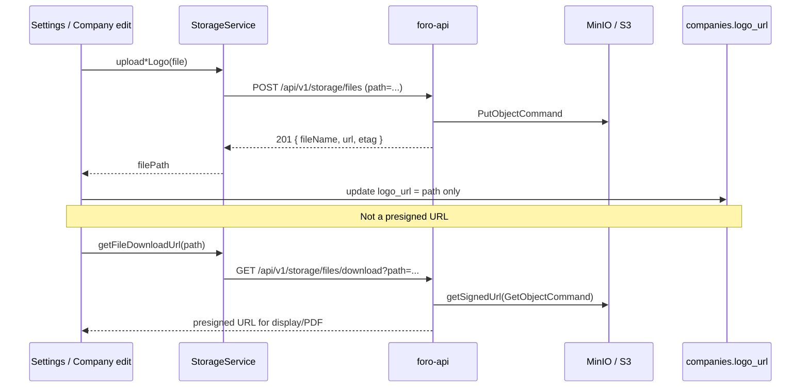

# Storage and logos (S3-backed via foro-api)

Foro stores uploaded assets (company logos, PDF embeds) via **foro-api**'s S3-compatible
storage endpoints (`/api/v1/storage/*`), backed by a self-hosted MinIO instance in this
environment. API shapes are defined in [`client-sdk/requests/03-STORAGE-REQUESTS.md`](../../client-sdk/requests/03-STORAGE-REQUESTS.md).

Database semantics for `logo_url` are unchanged conceptually — still a stored file **path**,
not a URL — see `foro-api/docs/database.md` for the `companies` table schema.

## Bucket

| Setting | Value |
|---------|--------|
| Bucket | **`foro`** in this environment (via `MINIO_BUCKET`) — configurable via foro-api's `S3_BUCKET` env var, defaulting to `foroman` if neither is set |
| Client code | [`storageService.ts`](../../src/services/storageService.ts) |
| Server config | [`foro-api/src/config/s3.ts`](../../../foro-api/src/config/s3.ts) — reads `S3_*` env vars, falling back to `MINIO_*` (self-hosted MinIO deployments expose credentials under those names instead) |
| Bucket ownership | **Server-side only** — the client never sends a bucket name in requests; foro-api's config owns it |

**Verified live** (2026-08-02): upload → presigned download → list → delete round-tripped
successfully against the configured MinIO bucket, and a real company-logo upload through
Settings → Company → Change Logo rendered correctly end-to-end. The bucket (`foro`) had to
be created once via the S3 API before first use — MinIO/S3 don't auto-create buckets.

## Client service

[`StorageService`](../../src/services/storageService.ts) centralizes uploads and presigned URLs:

| Method | Use |
|--------|-----|
| `upload(filePath, file)` | Multipart `POST /api/v1/storage/files` (`file`, `path`) |
| `uploadCompanyLogo(businessId, file)` | Issuer logo → `{businessId}/company_logo.{ext}` |
| `uploadClientCompanyLogo(companyId, file)` | Client company logo → `companies/{companyId}/logo.{ext}` |
| `getFileDownloadUrl(filePath)` | Presigned URL via `GET /api/v1/storage/files/download?path=...` (15 min expiry) |
| `delete(filePath)` | `DELETE /api/v1/storage/files?path=...` |
| `fetchFileAsObjectUrl(url)` | Authenticated fetch when URL requires headers |

[`ForoApiClient.postFormData`](../../src/backend/client/ForoApiClient.ts) must **not** set
`Content-Type` on `FormData` requests so the browser adds the multipart boundary.

## UI entry points

| Screen | Route / component | Upload helper |
|--------|-------------------|---------------|
| Business (issuer) logo | Settings → Company → [`BusinessSettingsTab.tsx`](../../src/pages/admin/settings/tabs/BusinessSettingsTab.tsx) | `uploadCompanyLogo` |
| Client company logo | Company edit → [`CompanyEditTab.tsx`](../../src/pages/admin/companies/companyPage/tabs/CompanyEditTab.tsx) | `uploadClientCompanyLogo` |
| Sidebar / invoice / quotation preview | [`AppSidebar`](../../src/components/elements/AppSidebar.tsx), [`InvoiceDetail`](../../src/components/elements/InvoiceDetail.tsx), [`QuotationDetail`](../../src/components/elements/QuotationDetail.tsx) | `getFileDownloadUrl` |
| PDF export | [`pdfLogoHelper.ts`](../../src/utils/pdfLogoHelper.ts), invoice/quotation/statement PDF utils | `getFileDownloadUrl` + base64 when `show_logo_on_documents` |

Allowed image types in settings UI: PNG, JPEG, SVG, WebP (max 5MB).

## Data flow

## Troubleshooting

| Symptom | Likely cause |
|---------|----------------|
| 500 on any storage call, correct request shape | Bucket doesn't exist on the S3/MinIO server yet — buckets aren't auto-created; create it once via `CreateBucketCommand` with the same credentials |
| Presigned URL fetch returns `NoSuchBucket` | Same as above — check `S3_BUCKET`/`MINIO_BUCKET` matches an actual bucket |
| 500 `Missing required environment variable` | Neither `S3_ACCESS_KEY_ID`/`S3_SECRET_ACCESS_KEY` nor `MINIO_ACCESS_KEY`/`MINIO_SECRET_KEY` are set |
| Upload OK, image broken in UI | `logo_url` empty, wrong path, or download auth missing |
| PDF without logo | `show_logo_on_documents` false or `logo_url` unset |
| Old logos after bucket change | Paths are bucket-agnostic; re-upload if objects lived in another bucket |

## Related docs

- [Storage and logos schema contract](../03-database/storage-and-logos-schema-contract.md) (Postgres/Skaftin-era — not authoritative post-migration, schema now lives in foro-api's MySQL `companies` table)
- [Document template / show logo](../plan.md) (historical plan; live flags on `companies`)
