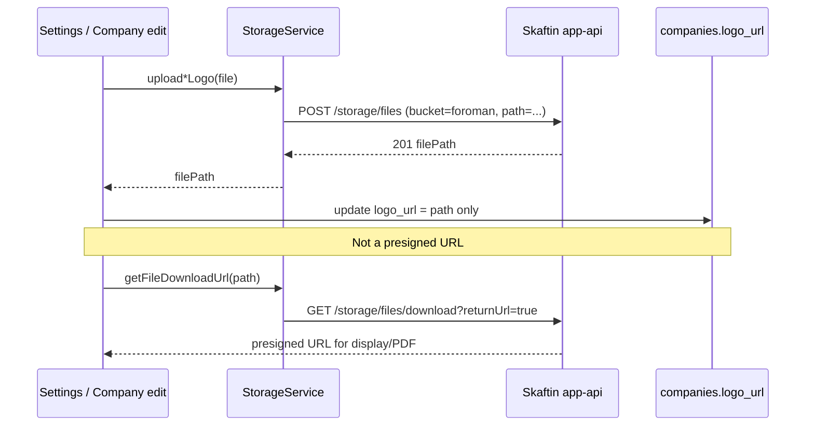

# Storage and logos (S3-backed via foro-api)

> **Migrated off Skaftin/MinIO.** Foro now stores uploaded assets (company logos, PDF embeds) via **foro-api**'s S3-backed storage endpoints (`/api/v1/storage/*`), not Skaftin MinIO. API shapes are defined in [`client-sdk/requests/03-STORAGE-REQUESTS.md`](../../client-sdk/requests/03-STORAGE-REQUESTS.md).

Database semantics for `logo_url` are unchanged conceptually — still a stored file **path**, not a URL — but the schema itself lives in foro-api's MySQL `companies` table now; see `foro-api/docs/database.md` rather than the stale `storage-and-logos-schema-contract.md` in this repo (Postgres/Skaftin-era, not authoritative post-migration).

## Bucket

| Setting | Value |
|---------|--------|
| Bucket | **`foroman`** (unchanged), configurable via foro-api's `S3_BUCKET` env var |
| Client code | [`storageService.ts`](../../src/services/storageService.ts) |
| Bucket ownership | **Server-side only** now — the client no longer sends a bucket name in requests (Skaftin required one; foro-api's `S3_BUCKET` env var owns it) |

**Verification gap:** actual S3 upload/download/delete was not live-tested against a real bucket during the migration (no S3 credentials configured in that environment) — request validation and auth-gating were verified, the S3 I/O itself was not. Verify before relying on this in production.

Verify with Skaftin MCP `list_project_buckets` or a test upload:

```bash
curl -X POST "$VITE_SKAFTIN_API_URL/app-api/storage/files" \
  -H "Authorization: Bearer $TOKEN" \
  -F "file=@/path/to/image.png" \
  -F "bucket=foroman" \
  -F "path=test/upload.png"
```

Expect **201** and `"success": true`.

## Client service

[`StorageService`](../../src/services/storageService.ts) centralizes uploads and presigned URLs:

| Method | Use |
|--------|-----|
| `upload(filePath, file)` | Multipart `POST /app-api/storage/files` (`file`, `bucket`, `path`) |
| `uploadCompanyLogo(businessId, file)` | Issuer logo → `{businessId}/company_logo.{ext}` |
| `uploadClientCompanyLogo(companyId, file)` | Client company logo → `companies/{companyId}/logo.{ext}` |
| `getFileDownloadUrl(filePath)` | Presigned URL for `` / fetch (1h expiry) |
| `delete(filePath)` | Remove object by path |
| `fetchFileAsObjectUrl(url)` | Authenticated fetch when URL requires headers |

[`SkaftinClient.postFormData`](../../src/backend/client/SkaftinClient.ts) must **not** set `Content-Type` on `FormData` requests so the browser adds the multipart boundary.

## UI entry points

| Screen | Route / component | Upload helper |
|--------|-------------------|---------------|
| Business (issuer) logo | Settings → Business → [`BusinessSettingsTab.tsx`](../../src/pages/admin/settings/tabs/BusinessSettingsTab.tsx) | `uploadCompanyLogo` |
| Client company logo | Company edit → [`CompanyEditTab.tsx`](../../src/pages/admin/companies/companyPage/tabs/CompanyEditTab.tsx) | `uploadClientCompanyLogo` |
| Sidebar / invoice / quotation preview | [`AppSidebar`](../../src/components/elements/AppSidebar.tsx), [`InvoiceDetail`](../../src/components/elements/InvoiceDetail.tsx), [`QuotationDetail`](../../src/components/elements/QuotationDetail.tsx) | `getFileDownloadUrl` |
| PDF export | [`pdfLogoHelper.ts`](../../src/utils/pdfLogoHelper.ts), invoice/quotation/statement PDF utils | `getFileDownloadUrl` + base64 when `show_logo_on_documents` |

Allowed image types in settings UI: PNG, JPEG, SVG, WebP (max 5MB).

## Data flow



## Troubleshooting

| Symptom | Likely cause |
|---------|----------------|
| 500 `Failed to upload file`, correct form fields | Wrong or unprovisioned bucket name |
| Upload OK, image broken in UI | `logo_url` empty, wrong path, or download auth missing |
| PDF without logo | `show_logo_on_documents` false or `logo_url` unset |
| Old logos after bucket change | Paths are bucket-agnostic; re-upload if objects lived in another bucket |

## Related docs

- [Storage and logos schema contract](../03-database/storage-and-logos-schema-contract.md)
- [Document template / show logo](../plan.md) (historical plan; live flags on `companies`)
